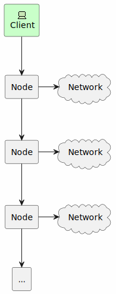

# Efficient Data Distribution with Reed-Solomon Codes for Sharded Storage

## Introduction

This writeup presents an efficient method for distributing N data elements across n nodes using Reed-Solomon (RS) encoding, specifically designed for blockchain storage solutions. We address the challenge of scaling blockchain storage by introducing techniques that achieve O(N log n) decoding complexity, where N is the total amount of data and n is the number of nodes.

A naive approach would be to simply blow up the data from N to bN, where b is the blowup factor. However, this would result in O(N log N) decoding complexity. Our method, by representing data as a table and creating data shards, achieves O(N log n) decoding complexity, which is significantly faster.

It's crucial to note that we don't need to apply RS codes to all data together. This is because a node can only go offline as a whole - there can't be a situation where two nodes lose half of their data each, requiring RS codes to recover the data. A node either loses all its data or provides it entirely.

While our method doesn't significantly improve the speed of calculating polynomial commitments (which remains O(N log N) for FRI), it greatly optimizes the data encoding-decoding procedure.

### Naive approach


### Our approach


## Notation and Definitions

Before proceeding with the detailed description of our method, let's define the key terms and symbols used throughout this writeup:

- N: Total amount of data elements
- n: Number of nodes in the network
- k: Minimum number of nodes required to recover the original data
- b: Blowup factor, defined as b = n/k
- m: Number of rows in the data table representation

## 2-Adicity Fields Case

We consider a 2-adic prime field, specifically the BabyBear field with prime p = 15 * 2^27 + 1.

Let's consider we have a vector ${a_i}$ of N elements of field $F_p$. We want to distribute this vector among n servers, such that any k servers can recover the original vector. We use Reed-Solomon codes to achieve this.

We represent the vector ${a_i}$ as a table ${a_{ij}}$ of size $m \times k$ with $m$ rows and $k$ columns.

We define a bivariate polynomial $f(x,y)$ to represent our data:

$$f(x,y) = \sum\limits_{ij} a_{ij} L_i(x) \lambda_j(y)$$

where $L_i(x)$ is a Lagrange polynomial of degree $m-1$ and $\lambda_j(y)$ is a Lagrange polynomial of degree $k-1$.


After performing FFT over each row of the table, $f(x,y)$ takes the following form:

$$f(x,y) = \sum\limits_{ij} b_{ij} L_i(x) y^j = \sum\limits_{j} f_j(x) y^j$$

where $f_j(x)=\sum\limits_{i} b_{ij} L_i(x)$ is a polynomial of degree $m-1$.


Each node should receive a unique linear combination of the columns of the table. Then we can recover the original vector by solving a system of linear equations. Let's represent the data shard as $f(x,y_0)$, where $y_0$ is a fixed value for each shard.

$$f(x,y) - f(x,y_0) = \sum\limits_{j} (y^j - y_0^j) f_j(x) = (y-y_0) q(x,y)$$

where $q(x,y)$ is a quotient polynomial.


We make the substitution $y=x^m$ without loss of any inner polynomial structure. This substitution effectively concatenates all columns of the table, one after another, which is convenient for creating a polynomial commitment.

After the substitution, we get the following polynomial equation to check that the shard is a valid part of the original data:

$$ f(x,x^m) - f(x, y_0) = (x^m - y_0) q(x,x^m) $$

## Circle Fields Case

We now consider the M31 field with p = 2^32 - 1. [HLP24] proposed a method called CFFT (Circular Fast Fourier Transform), which is analogous to FFT but works with polynomials defined on a complex circle.

In the circle representation, the polynomial takes the form $f(x,y)=\Re(f(z))$, where $|z|=1$.

Due to the circle constraint $|z|^2 = x^2 + y^2 = 1$, the polynomial can be represented as:

$$f(x,y) = f_0(x) + y f_1(x)$$

where $f_0(x)$ and $f_1(x)$ are polynomials of degree $N/2-1$. Note that we have two polynomials of this degree, providing sufficient degrees of freedom.

Let's represent the data vector ${a_i}$ as a table ${a_{ij}}$ of size $m \times k$ with $m$ rows and $k$ columns. We perform circle FFT (CFFT) on each row of the table, resulting in $m$ vectors of size $n$.

$$f(x,y,u,v) = \sum\limits_{ij} a_{ij} L_i(x,y) \lambda_j(u,v)$$

It's important to note that the function $f(x,y,u,v)$ is defined on a torus: $x^2+y^2=1$, $u^2+v^2=1$.

Let's consider $f(x,y,u,v)$ as $v$-even function. This approach is not useful directly for SNARKs, because then we have even constraint on function values and next row could be dependent on the previous one. However, it's useful for data distribution.

Then 

$$f(x,y,u,v) = f(x,y,u) = \sum\limits_{ij} a_{ij} L_i(x,y) \Lambda_j(u) $$,
where $\Lambda_j(u)$ is even Lagrange basis on the circle.


After applying CFFT over each row, we get:

$$f(x,y,u) = \sum\limits_{ij} b_{ij} L_i(x,y) u^j = \sum\limits_{j} f_j(x,y) u^j$$

where $f_j(x,y)=\sum\limits_{i} b_{i} L_i(x,y)=f_{j,0}(x) + y f_{j,1}(x)$ and each polynomial is $(m/2-1)$-ordered.

Let's consider $f(x,y,u_0)$ as a data shard, where $u_0$ is a fixed value for each shard.

$$f(x,y,u) - f(x,y,u_0) = \sum\limits_{j} (u^j - u_0^j) f_j(x,y) = (u-u_0) q(x,y,u)$$

where $q(x,y,u)$ is a quotient polynomial.

We make the substitution $u=x^{m/2}$ in $f(x,y,u)$. This substitution does not result in information loss because $f_j(x,y)=f_{j,0}(x) + y f_{j,1}(x)$, where the degrees of $f_{j,0}(x)$ and $f_{j,1}(x)$ are $m/2-1$. The resulting polynomial $f(x,y,x^{m/2})$ maintains the structure $f_0(x) + y f_1(x)$ and remains defined on a circle, albeit with each one-dimensional component now of degree $N/2-1$. This substitution effectively concatenates all columns of the table, similar to the 2-adicity case.


After the substitution, we get the following polynomial equation to check that the shard is a valid part of the original data:

$$f(x,y,x^{m/2}) - f(x,y,u_0) = (x^{m/2}-u_0)q(x,y,x^{m/2})$$

## Applications

### Recovering the source data

Any $k$ shards are enough to recover the original data. 

$$f(x,y,u) = \sum\limits_{j} c_{ij} L_i(x,y) \mu(u),$$
    
where $\{\mu_i(u)\}$ is a Lagrange polynomial basis on the evaluation domain $H=\{u_i\}$, and $u_i$ are fixed values for each shard.

$$ \mu_i(u) = d_i Z_{H}(u)/(u-u_i),$$
where $Z_{H}(u)$ is a polynomial that is zero at all points of $H$, $d_i$ is a normalization factor, so

$$ \mu_i(u) = \begin{cases}
1, & u = u_i \\
0 & u \neq u_i
\end{cases}
$$

The source values could be computed as 
$$a_{ij} = f(g^i.x, g^i.y, g^j.x)$$

### Polynomial storing
In some cases, we want to store something directly related to the polynomial commitment of $f$ instead of $a_{ij}$. This is important for zk applications, like rollups.

Due to the inner structure of coefficient representation, we can represent $g(x,y)$ as $f(x,y,x^{m/2})$. That means that we can store rollup block data as a set of shards, keeping the source polynomial structure, keeping the source commitment. Then $a_{ij}$ will be some kind of intermediate representation of the committed data.


## Algorithm description


```python

def get_shards_and_commitments(data: List[M31], m:int, n:int, k:int, cd:Domain, rd:Domain, xrd:Domain)
    # data is a list of N elements
    # m is the number of rows in the table
    # n is the number of nodes
    # k is the number of nodes required to recover the original data
    # cd is the evaluation domain for the columns
    # rd is the evaluation domain for the rows
    # xrd is evaluation domain for the shards (blown up rows)
    # Returns polynomial commitments and prover data for all the data and shards
    
    # create a table of size m x k, fulfilled row by row
    table = create_table(data, m, k)
    
    # perform cfft on each row of the table
    for row in table:
        row[:] = cfft(row, rd)
    
    # create shards
    shards = [icfft(fit_to_domain_with_zeros(row, rd, xrd), xrd) for row in table]
    
    # convert to col-ordered table
    shards = to_col_ordered(shards)

    # convert table to col_ordered
    table = to_col_ordered(table)

    # compute monomial representation of $f(x,y,x^{m/2})$
    f = concat([cfft(col, cd) for col in table])

    return pcs_monomial_repr(f), [pcs(shard) for shard in shards]

```

## Distributing the data over a cluster of nodes

In practice, the client should deliver the data to $n$ nodes, and the total amount of data is $bN$. However, for big files, it could be inefficient due to the client's limited bandwidth. 

Instead of this client-centralized approach, $b$ nodes could deliver $N \cdot (1-1/k)$ total data to $k-1$ nodes. There is no bottleneck at the client side (the client sends just $N$ data to one node), but total network data bandwidth is $b N \cdot (2-1/k) \approx 2bN$.



There is no valuable computational overhead to compute the shards vectors because with fft or cfft each node can perform a unique coset shift instead of blowup (and the sum of all shifted evaluation domains is the evaluation domain for the blowup).


## Conclusion

We have extended our method of data representation to the M31 field, providing a robust framework for efficient data distribution in blockchain storage. By representing data as a table and using FFT/CFFT techniques, we achieve O(N log n) decoding complexity, significantly optimizing the data encoding-decoding procedure. This approach is particularly valuable in blockchain systems where nodes can only fail as a whole, and efficient data recovery is crucial.

While the complexity of polynomial commitment calculations remains O(N log N) for FRI, our method provides substantial benefits in the overall data handling process, making it a promising solution for scalable blockchain storage.

## References

[HLP24](https://eprint.iacr.org/2024/278)