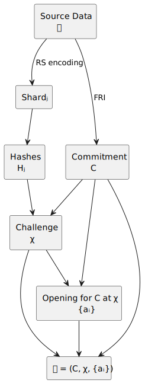
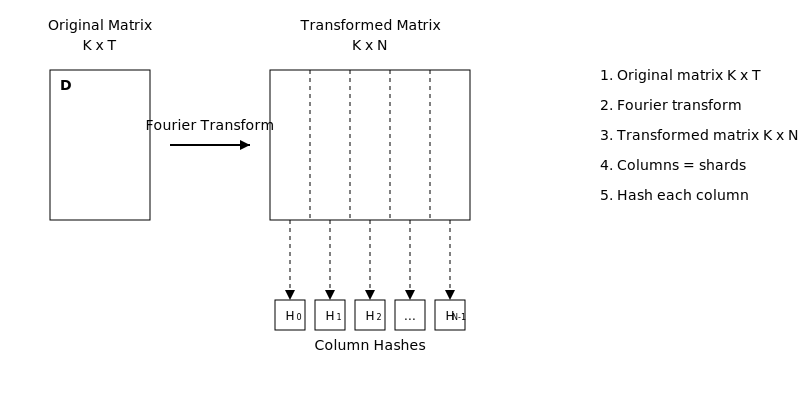
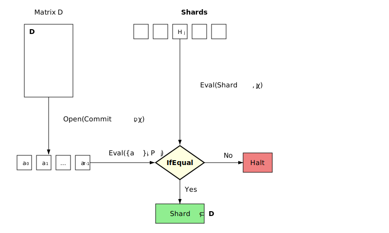

# Using FRI for DA with Optimistic Correctable Commitments in Rollups

## Abstract

Scaling blockchains and transitioning from Web2 to Web3 require efficient solutions for storing and accessing large volumes of data. We present a new technique for using FRI commitments combined with optimistic correctable commitments to implement Data Availability (DA). This allows for a significant reduction in the volume of data stored on-chain, by hundreds and thousands of times compared to the volume of data served by the distributed network. For each cluster of megabytes, it is sufficient to store only a short 32-byte hash on-chain. In the context of rollups, we introduce a new commitment construction that ensures reliable storage and data availability when used in rollups instead of the standard commitment $C$. Combined with recursive rollups, our solution paves the way for unlimited blockchain scaling and the transfer of Web2 to Web3, ensuring reliability, security, and data availability.

## Introduction

### The Problem of Scaling and Data Storage in Blockchain

Blockchains produce enormous amounts of data, and efficient management of this data is critical for their scaling and widespread application in Web3. Traditional solutions, such as Filecoin, do not provide reliable data storage at the consensus level. Other solutions, like Arweave, while offering storage reliability, are not suitable for dynamic Web3 applications due to the impossibility of modifying or deleting data.

Modern solutions, such as EthStorage and 0g, aim to solve these problems but face limitations:

- **EthStorage** uses data replication, requiring the storage of multiple copies of the same volume of data to ensure reliability.
- **0g** applies Reed-Solomon codes for data sharding but uses KZG10 commitments, which are not optimal for building recursion — a key mechanism for scaling through recursive rollups.

### The Potential of Our Solution

- **Scaling through recursive rollups**: Support for recursive rollups allows for a significant increase in network throughput. This is achieved by processing large volumes of data off-chain and storing only minimal commitments on-chain. This approach provides unlimited scaling without compromising security and decentralization.

- **Ease of Use through Account Abstraction**: Despite the technical complexity of recursive rollups, they remain transparent for end users and developers. With the implementation of account abstraction, users don't need to concern themselves with which specific rollup stores their funds — they see a total balance and can perform operations without additional complications. Similarly, developers of decentralized applications can create services without worrying about which rollup processes their data. This is akin to how Bitcoin wallets use UTXO abstraction: users see their total balance without delving into technical details. Thus, our solution provides scalability without compromising convenience and accessibility for users and developers.

- **Economical data storage**: Our solution allows storing hundreds or thousands of times less information on-chain compared to the volume of data processed off-chain. For each megabyte of data distributed in the network, only a short 32-byte hash is stored on the blockchain. This significantly reduces storage and transaction costs, making the technology more accessible for mass adoption.

- **Flexibility through off-chain block transfer**: Using recursive rollup technology, blocks can subsequently be moved off-chain without losing data integrity and availability. This provides flexibility in network architecture and optimizes resource usage.

- **Transformation of Web2 to Web3**: Our technology provides infrastructure for transferring existing Web2 applications and services to the decentralized Web3 environment. This opens up new opportunities for companies, allowing them to leverage the advantages of blockchain — security, transparency, and decentralization — without the need to completely rethink their business models.

- **Competitive advantage**: Unlike existing solutions, our proposal combines efficiency, scalability, and compatibility with advanced technologies such as recursive rollups. This creates a significant competitive advantage and sets new standards in the industry.

### Our Goal

We propose a solution that allows the use of FRI (Fast Reed-Solomon Interactive Oracle Proofs of Proximity) for DA with optimistic correctable commitments. This provides:

- **Efficient data storage**: Storing only a small commitment (e.g., 32 bytes) on-chain for data clusters of several megabytes.
- **Compatibility with recursive rollups**: Reducing the volume of data required for on-chain storage, contributing to unlimited blockchain scaling.
- **Data reliability and availability**: Ensuring data correctness and availability even in the presence of errors or malicious actions.

## Preliminary Information

### FRI and Its Application

**FRI** is a method used in zkSNARK protocols to verify the proximity of data to Reed-Solomon code. It allows creating compact commitments to large volumes of data and provides efficient verification of their correctness.

### Problems When Using FRI for DA

Direct implementation of FRI for DA faces problems:

- **Incorrect commitments**: A malicious participant can present a commitment with errors in correction codes. If these errors are few enough, such a commitment will be accepted by the network.
- **Lack of connection between commitment and data**: Even if the data is recovered, establishing a connection with the original commitment is difficult due to possible errors in the original commitment.

## Our Solution: Optimistic Correctable Commitments

We propose an extension over FRI that solves these problems by introducing a new commitment construction $\mathcal{C} = (C, \chi, \{a_i\})$, where

$\mathbf{D}$ - data we want to store in the network,

$C=\mathrm{Commit}(\mathbf{D})$ - commitment to the data,

$\mathrm{Shard}_j$ - shards into which the data is divided using Reed-Solomon codes,

$H_j = \mathrm{Hash}(\mathrm{Shard}_j)$ - hash of the shard,

$\chi = \mathrm{Challenge}(C, \{H_j\})$ - pseudorandom challenge,

$\{a_i\}$ - result of opening the commitment $C$ at $\chi$.

This construction provides:

- **Connection between data and commitment**: Ensures that the data corresponds to the commitment and can be verified.
- **Possibility of error correction**: The system is capable of detecting and correcting errors without trusting validators or clients.
- **Use in rollups**: Provides mechanisms for integration with rollups, allowing them to use $\mathcal{C}$ instead of the standard commitment $C$.

## Implementation Details

### Data Structure and Sharding

#### Data Representation

Let the data $D$ be represented as a matrix of size $T \times K$, where $|D| = T \cdot K$. We consider the matrix as a function of columns.

#### Domain Extension

We apply domain extension to the matrix, increasing the number of columns from $K$ to $N$ using Reed-Solomon codes and the Discrete Fourier Transform (DFT). This allows for redundancy for error correction.

#### Data Sharding

The resulting matrix has a size of $T \times N$. Each column $\text{Shard}_j$ (for $j = 1, \dots, N$) is considered as a separate data shard. These shards are distributed among network nodes for storage.

#### Shard Hashing

Each shard is hashed using a cryptographic hash function:

$$
H_j = \mathrm{Hash}(\text{Shard}_j).
$$

### Commitment Generation and Opening

#### Commitment to Data

We apply FRI to the matrix, considering it as a function of rows. This allows obtaining a commitment $C = \mathrm{Commit}(D)$, compactly representing all the data.

#### Random Point Generation

We use the **Fiat-Shamir heuristic** to calculate a pseudorandom point $\chi$, dependent on the commitment and shard hashes:

$$
\chi = \mathrm{Challenge}(C, H_1, H_2, \dots, H_N).
$$

#### Commitment Opening

We perform a polynomial opening of the commitment $C$ at point $\chi$, obtaining proof $\{a_i\}$:

$$
\{a_i\} = \mathrm{Open}(C, \chi).
$$

### New Commitment Construction for Rollups

#### Use in Rollups

When applied in rollups, $\mathcal{C}$ is used instead of the standard commitment $C$.

### Shard Correctness Verification

For each shard $\text{Shard}_j$, a node can verify it without the need to store all the data:

1. **Calculate the shard value at point $\chi$**:

   $$
   s_j = \mathrm{Eval}(\text{Shard}_j, \chi).
   $$

2. **Calculate the opening value at the point corresponding to the shard**:

   $$
   s'_j = \mathrm{Eval}(\{a_i\}, P_j),
   $$

   where $P_j$ is the point associated with sharding.

3. **Compare values**:

   $$
   s_j \stackrel{?}{=} s'_j.
   $$

If the equality holds, shard $\text{Shard}_j$ is considered correct.

#### Correctness Lemma

**Lemma**: If for shard $\text{Shard}_j$ the equality $s_j = a_j$ holds, then with high probability $\text{Shard}_j$ is a correct shard of data $D$.

**Proof**:

Using the **Schwartz-Zippel lemma**, we know that two different polynomials of degree $d$ can coincide in no more than $d$ points out of $|F|$, where $F$ is the field. Since $\chi$ is chosen randomly, the probability that an incorrect shard will pass the check is $\frac{d}{|F|}$, which is negligibly small for large fields.

## System Architecture

### Data Writing Process

1. **Transaction Initiation**:

   - The client forms a transaction with data $\mathbf{D}$ and metadata $\mathcal{M}$:
     - Commitment $C$.
     - Shard hashes $\{H_j\}$.
     - Opening $\pi = \{a_i\}$ at point $\chi$.
     - Construction $\mathcal{C} = (C, \chi, \{a_i\})$.

2. **Transaction Validation**:

   - Validators check the client's signature.
   - Verify the correctness of metadata and opening $\pi$.
   - Verify the correctness of $\mathcal{C}$.

3. **Transaction Signing**:

   - If all checks are successful, validators sign the transaction and transmit metadata and shards to network nodes.

4. **Shard Distribution**:

   - Data $\mathbf{D}$ is sharded, and shards $\{\text{Shard}_j\}$ are distributed among network nodes.

5. **Node Verification**:

   - Nodes receive their shards and check:
     - Correspondence of shard hash $H_j$ and received shard $\text{Shard}_j$.
     - Correctness of opening $\pi$ and construction $\mathcal{C}$.
     - If all checks are successful, nodes sign the transaction, after which the transaction can be included in a block.

6. **Metadata Storage**:
   - Nodes parse the verified metadata into fragments, sign them using threshold signature, and distribute these fragments for storage among themselves.

### Optimistic Error Correction

If errors or inconsistencies are detected:

- **Decentralized Recovery**: Nodes jointly recover correct data using the redundancy of Reed-Solomon codes.
- **Fraud Proofs**: Nodes can form fraud proofs if they detect incorrect actions.
- **Use of SPoRA Mining**: In the process of SPoRA mining, nodes find in their data structure the data for which they can receive a reward. We have improved SPoRA mining to incentivize the node to recover all original data and commitments for the sectors involved in mining. Thus, to check the correctness of shard hashes and commitment, the miner only needs to compare several hashes, which minimally uses their resources but stimulates the miner to actively check and recover data.

## Classification and Elimination of Errors

### Types of Defects

#### Uncorrectable Defects

- **Incorrect metadata structure**: Inability to interpret $C$, $\pi$, $\{H_j\}$, $\mathcal{C}$.
- **Mismatch between hash and shard**: $H_j \neq \mathrm{Hash}(\text{Shard}_j)$.

**Reaction**: The transaction is rejected by validators and nodes.

#### Metadata Inconsistency

- **Incorrect opening**: Checking $\pi$ returns false.
- **Mismatch in shard verification**: $s_j \neq a_j$.
- **Incorrect calculation of $\chi$**: $\chi$ does not correspond to the calculated value from $C$ and $\{H_j\}$.

**Reaction**:

- Nodes form **fraud proofs**, proving incorrectness.
- Validators who proposed such a transaction are subject to penalties.

#### Correctable Defects

- **Errors in correction codes**: Small errors in shards that can be corrected.

   Circuit for this fraud proof for 1 MiB cluster requires $\sim 3 \cdot 2^{15}$ $(16 \to 8)$ poseidon2 hashes.

- **Partial incorrectness of shards**: Some shards are damaged but can be recovered from others.

   Circuit for this fraud proof for 1 MiB cluster requires $\sim 2^{15}$ $(16 \to 8)$ poseidon2 hashes.

**Reaction**:

- Nodes use data redundancy to recover correct shards in the mining process.
- Miners will form **fraud proofs** consisting of a zkSNARK that recalculates this data correctly. Since the data of one block is just hundreds of thousands of field elements, there is no difficulty for the miner to generate such a zkSNARK. The proof and verification of the zkSNARK will be paid from the penalty of validators who proposed such a transaction.

### Security Guarantees

It's important to note that the optimistic elements of the protocol do not reduce the security of the system, as the assumption of the presence of a sufficient number of honest nodes is as reliable as these elements themselves. If an honest node misses defects or refuses to store data, it still won't be able to mine and receive rewards.

* Data preservation with an honest minority: If there is a sufficient number of honest nodes in the network, the data will be correctly stored and correspond to the corrected code close to the original code used to generate the commitment. Even if the commitment or shards were generated with errors, the network will be able to correct them and restore the data without errors.

* Protection against incorrect changes: In the process of error correction, a dishonest majority will not be able to substitute shard hashes with incorrect ones or replace the commitment with one that does not correspond to the corrected code. This guarantees the immutability of data and their correspondence to the stated commitment. If there is already an accepted commitment in the network, it is impossible to introduce errors into it during the error correction process, even if the client, all validators, and all nodes are malicious.

## Examples and Scenarios

### Example 1: Data Recovery with Errors

**Situation**: Several shards are damaged due to failures.

**System Actions**:

1. **Error Detection**: Nodes detect incorrect shards during verification.
2. **Data Recovery**: Using Reed-Solomon code redundancy, nodes recover correct shards.
3. **Metadata Update**: Update corresponding shard hashes $H_j$.
4. **Continued Operation**: The system functions without interruptions, data remains available.

### Example 2: Use in Rollups

**Situation**: A developer implements our system in a recursive rollup.

**Actions**:

1. **Integration of $\mathcal{C}$**: The rollup uses the construction $\mathcal{C} = (C, \chi, \{a_i\})$ instead of the standard commitment $C$.
2. **Additional Opening**: The rollup performs commitment opening at point $\chi$ and includes this in the state proof.
3. **State Verification**: Using $\mathcal{C}$, the rollup proves the correctness of its state in zkSNARK or zkSTARK.
4. **Scaling**: Data corresponding to $\mathcal{C}$ is not stored on-chain, which allows for a significant reduction in the volume of data stored on-chain.

## Explanation of Key Concepts

### Fiat-Shamir Heuristic

A method of transforming interactive protocols into non-interactive ones using hash functions. In our case, it is used to generate a pseudorandom point $\chi$ dependent on the commitment and shard hashes.

### Schwartz-Zippel Lemma

A theorem stating that two different polynomials of degree $d$ can coincide in no more than $d$ points from field $F$. It ensures that the probability of successful forgery of verification is negligibly small.

### Reed-Solomon Codes

Error correction codes that allow data recovery in the presence of errors or losses. Used to create redundancy and ensure reliability of data storage.

### $\mathcal{C}$ Construction in Rollups

- **Why it's needed**: Provides a link between data and commitment, allowing rollups to prove the correctness of their state.
- **How it's used**: The rollup includes $\mathcal{C}$ in its proofs, which guarantees data availability and its correspondence to the commitment.
- **Advantages**:
  - Reduction of on-chain data volume.
  - Increasing proof efficiency.
  - Ensuring data reliability and availability.

## Conclusion

We have presented a technique for using FRI for DA with optimistic correctable commitments, introducing a new construction $\mathcal{C} = (C, \chi, \{a_i\})$, which is especially useful in the context of rollups. Our system allows for a significant reduction in the volume of data stored on-chain and ensures data reliability and availability. It provides developers with new tools for creating scalable decentralized applications, integrating with recursive rollups, and incentivizing nodes to behave honestly through SPoRA-mining mechanisms and fraud proofs.

## Appendices

### Detailed Explanation of Commitment and Opening

#### Commitment Generation

1. **Data**: Matrix $D$ of size $T \times K$.
2. **Function**: consider rows of $D$ as values of T-1 degree polynomial function $f(x)$ over field $F$.
3. **FRI Application**: Apply FRI to $f(x)$ to obtain commitment $C$.

#### Generation of Random Point $\chi$

- Use a hash function to generate $\chi$:
  $$
  \chi = \mathrm{Hash}(C, H_1, H_2, \dots, H_N).
  $$

#### Opening at Point $\chi$

- Calculate values $\{a_i\}$ necessary to prove that $f(\chi)$ corresponds to the data.

### Use in Rollup

- **Additional Opening**: The rollup includes in the proof the opening of the commitment at point $\chi$, i.e., $\{a_i\}$.
- **$\mathcal{C}$ Construction**: The rollup publishes $\mathcal{C} = (C, \chi, \{a_i\})$.
- **Advantages**:
  - Provides data verifiability without the need for access to all data.
  - Guarantees that data is available and stored in the network.
  - Allows the rollup to reduce the volume of data needed for on-chain storage.

### Proof of the Correctness Lemma

**Assumption**: Let $\text{Shard}_j$ be incorrect but pass the check $s_j = a_j$.

**Probability**:

- The probability that an incorrect shard will coincide at point $\chi$ with a correct one is $\frac{d}{|F|}$, where $d$ is the degree of the polynomial.
- For a large field $F$, the probability is negligibly small.

**Conclusion**: With high probability, if a shard has passed the check, it is correct.