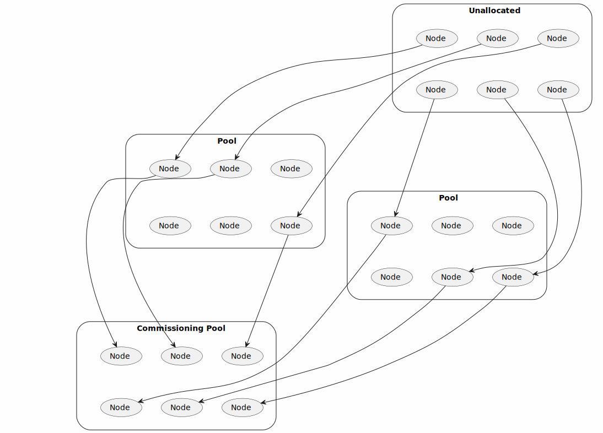
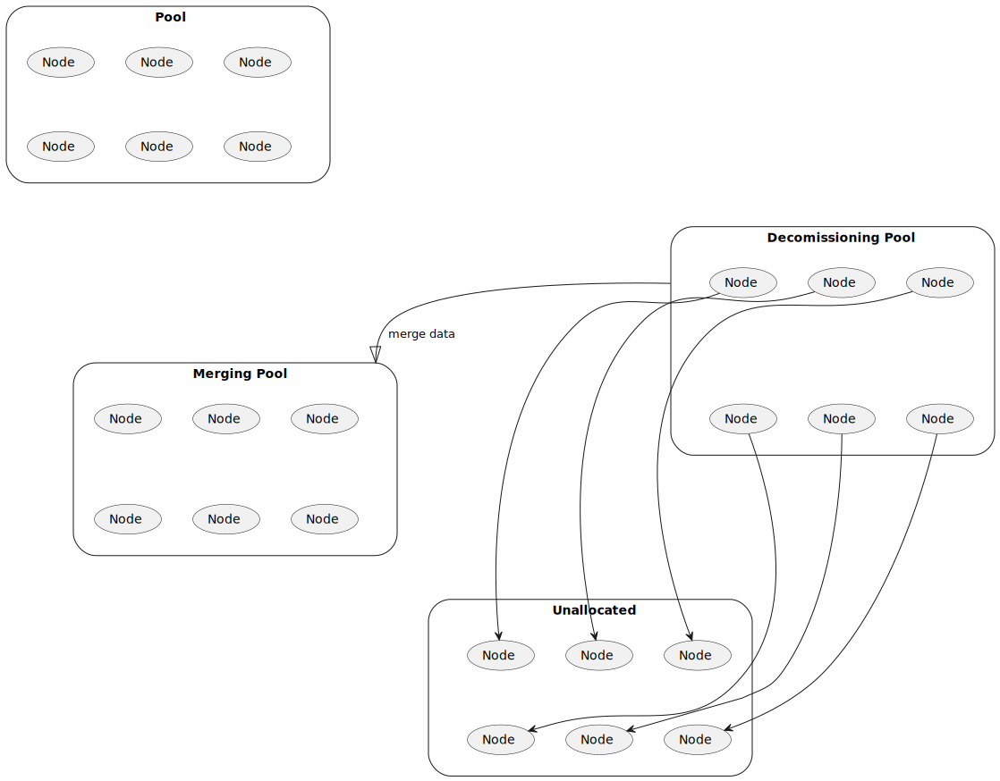

# Blockchain Sharded Storage: Web2 Costs and Web3 Security with Shamir Secret Sharing

*Thanks to [Ivan Oleynikov](https://github.com/gnull) for editing and feedback.*

## Abstract

CPU scaling for blockchain is solved. However, storage scaling is still a problem. This document
describes a horizontally scalable fault-tolerant storage solution for blockchain that can process
large amounts of data (beyond petabytes) with Web2 storage overhead and Web3 security. With this
solution, rollups no longer need to store their blocks on-chain. In other words, we can upgrade
validiums to rollups and nest the rollups recursively into each other with close to zero cost of data storage.

Our solution uses [Shamir's Secret Sharing](https://en.wikipedia.org/wiki/Shamir%27s_Secret_Sharing)
to split the payload into shards and distribute it among nodes for storage,
and later retrieve the shards and recover the payload using [Fast Fourier
Transform](https://zcash.github.io/halo2/background/polynomials.html#fast-fourier-transform-fft).
Nodes are paid by the file owner for storing the shards, which is periodically verified using
zkSNARK. We employ a special shuffling technique to decide which nodes will store the shards of a
given file.  As long as at least half of the network behaves honestly, this technique ensures that
a malicious adversary can not cause a DoS attack on the file by controlling a critical number of its
shards.

We present the details of our solution, analyze the cryptographic security guarantees it provides and propose a set of economic incentives to motivate honest node behavior.

## Introduction

### Problem Statement

One of the solutions used for storage scaling on blockchain today is a replication of data.
It stores each chunk of payload on multiple nodes.
Nodes produce zero-knowledge proofs of data availability.
When the number of nodes storing the chunks is low,
  the network distributes the chunks to other nodes.

Let's discuss the features of this approach that make it more expensive than Web2 storage.

1. Redundancy. If we want to build a 50% fault-tolerant network with 128 bits of security,
we need to replicate data 128 times. It means that the network should store and transfer 128 times 
more data than the payload.

2. Preventing deduplication. The replicas of stored data are identical, therefore
the nodes that are storing them could try to collude and deduplicate it: collectively store only one
replica, saving the costs, but bill the network for storing many replicas. The network mitigates
this by applying a distinct encoding to each replica and requiring each node to periodically
prove that it holds the encoding given to it. This encoding makes conversion between replicas
computationally hard, making deduplication impractical.

   The drawback of this approach is that zero-knowledge proofs now need to be aware of the encoding,
     adding extra computational overhead for honest nodes.

3. Data distribution.
The nodes holding replicas of a file may go offline at any moment.
When this happens, the network redistributes the replicas to more nodes
  to ensure the needed level of redundancy.
An adversary who controls a large portion of the network
  could use this mechanism to try to collect all replicas of a given file.

   The network mitigates this by periodically randomly shuffling nodes between the pools of different files.
   Informally speaking, this ensures that the fraction of the adversary's nodes in each pool stays close to the fraction of its nodes in the whole network.

In the following sections, we propose our solution to this problem with better security and performance than replication.
Additionally, our solution is natively zkSNARK-friendly,
  as its polynomial computations can be efficiently done in a zkSNARK.
That means that we can include proofs of data availability in proofs of rollup state transitions with little overhead.
It will allow us to upgrade validiums to rollups with close to zero cost of data storage.

Our solution implements data redistribution similarly to the above to account for nodes going offline.
We additionally periodically shuffle the nodes between the pools
  to make sure that malicious nodes are distributed evenly between the pools,
  and that the adversary can not monotonously increase the presence of malicious nodes in a given pool
    due to honest nodes of that pool going offline over time.

### Use Cases

Our proposed solution can be seen as a very big decentralized HDD with large (megabytes) sectors.
As bare metal HDDs,
  it provides CRUD operations on sectors,
  which is directly inefficient for many cases like small files or databases.
However, it is very efficient for storing big files, like videos, images, and backups.

Also, it is efficient for rollups: the rollups can store their blocks in sectors of the network and merge state transition zk proofs with proofs of data availability.

This approach makes validiums obsolete. We can upgrade validiums to rollups keeping the same level of security and cost of the storage.

On the rollup level, we can implement all remaining use cases, like databases, small files, and so on.

This can help solve the problem of blockchain bloat. We can directly fulfill the rollup state at the checkpoint and then all history of the rollup before the checkpoint could be removed.

Also, very cheap storage may enable us to implement a lot of web2 solutions,
  like messengers, social networks, blogs, games, and so on on the blockchain with true decentralization.

## Preliminaries

### Shamir's Secret Sharing

[Shamir's Secret Sharing](https://en.wikipedia.org/wiki/Shamir%27s_Secret_Sharing) is a method for 
distributing a secret among a group of participants, each of which is allocated a share of the secret. 
The secret can be reconstructed only when a sufficient number of shares are combined. The sufficient 
number is called the threshold. The threshold can be any number between 1 and the total number of shares. 
The secret cannot be reconstructed from any number of shares less than the threshold.

One of the simplest ways to implement Shamir's Secret Sharing is to use a polynomial of degree N-1. We can 
represent the N-sized secret as a polynomial of degree N-1. We can evaluate this polynomial at M points and 
get M values. Then we distribute these values among M participants. The secret can be restored from any 
N values.

> The way we use Shamir's Secret Sharing here can be alternatively characterized as encoding the data 
with [Reed–Solomon Error Correcting Code](https://en.wikipedia.org/wiki/Reed%E2%80%93Solomon_error_correction) 
and decoding with erasures (not errors). Especially since the message we encode is not secret. In the following, 
we keep calling it Secret Sharing because more readers may be familiar with this term.

For well-selected $N$ and $M$, we can restore the secret if most of the participants will go offline. 
We will use this property to build a fault-tolerant storage of publicly available data.

### Polynomial Computation for Data Recovery

One can recover a secret shared using Shamir's scheme using
  [Lagrange interpolation](https://en.wikipedia.org/wiki/Lagrange_polynomial),
  we briefly outline the mechanism below.

Let's consider $p(x)$ is a polynomial of degree $N-1$ and the secret is the evaluation representation of 
this polynomial over evaluation domain $\mathbf{D}=\{0,\ 1,\ 2,\ ...,\ N-1\}$:

$$\mathbf{S} = \{p(0),\ p(1),\ p(2),\ ...,\ p(N-1)\}.$$

We will compute the polynomial over the extended evaluation domain $0,\ 1,\ 2,\ ...,\ M-1$ and 
distribute the values to M participants.

Let's represent the case when all participants excluding N are going offline. So, we get the following 
values:

$$\mathbf{V} = \{p(k_0),\ p(k_1),\ p(k_2),\ ...,\ p(k_{N-1})\}$$

over evaluation domain

$$\mathbf{K} = \{k_0,\ k_1,\ k_2,\ ...,\ k_{N-1}\}.$$

Let's define Lagrange polynomials over evaluation domain $\mathbf{K}$:

$$\mathbf{L_i}(x) = c_i \prod_{j \neq i} \left(x - k_j\right),$$

where $c_i$ is a constant coefficient, so that $\mathbf{L}_i(k_i) = 1$.

Let's define matrix $\mathbf{L}_{ij}=\mathbf{L}_i(j)$.

Then the secret can be restored as follows:

$$\mathbf{S_j} = \sum_{i} \mathbf{V_i} \cdot L_{ij}$$

> What happens if some of the participants are malicious and send incorrect values?
There is more than one way to solve this.
For our partial case, we will merkelize all values and distribute them to all participants with Merkle proofs.
Then we can check the correctness of each value,
  checking the root of the Merkle proof.
If the root is incorrect, we can ignore the value.
In terms of error-correcting codes, this corresponds to an erasure.

### zkSNARKs

[Zero-Knowledge Succinct Non-Interactive Argument of Knowledge](https://en.wikipedia.org/wiki/Non-interactive_zero-knowledge_proof)
  is a cryptographic primitive that lets a Prover convince a Verifier that it knows a secret witness $y$
  such that $P(x, y)$ for public polynomially-computable predicate $P$ and public instance value $x$.

They are heavily used to provide privacy for the data a blockchain works with.
In this architecture, a smart contract on blockchain only holds a commitment to its state,
  and clients initiate transactions asking to update that hash providing the zkSNARK proof of the transition being done correctly.
This way, the state held by the smart contract (or some parts of such state) can remain private,
  while still ensuring that state transition happens according to some rules.

Another use-case for zkSNARKs is CPU scaling of blockchain.
zkSNARKs allow verifying the proof faster than the computation of predicate $P$ would take.
This way, if verifying state transition requires too many resources,
we can use recursion and only verify the final result on the blockchain.

We use zkSNARKs in this solution for both.
In the following description, we often make the use of zkSNARKs implicit.

### Polynomial Commitment Schemes

Polynomial Commitment Schemes are [commitment schemes](https://en.wikipedia.org/wiki/Commitment_scheme)
  where one can commit to a polynomial of a fixed degree,
  and then reveal individual points of that polynomial
  and prove that the degree of the polynomial committed to is limited.

#### Selection of Polynomial Commitment Scheme

We propose using FRI, because it is not additive-homomorphic, and it is more suitable for 
our case. The usage of additive-homomorphic commitment schemes could lead to attacks when 
the malicious nodes use MPC to compute proofs of data availability without storing all data.

To build a random proof of random opening of the polynomial commitment, the prover should
keep all the data. Other nodes cannot help him to compute this proof with the MPC procedure.

### Space-time Tradeoff and Plotting

For proof of space-time mining, we need to build a plot which is an array of high entropy data,
and computing any one element of this array without storing the whole array should be a hard
problem.

The approach how to build plots is described at [AACKPR2017](https://eprint.iacr.org/2017/893.pdf).

To build the plot, let's define 

$f_1(x)=h(x),$

$f_{i+1}(x) = h(x, x_1),$ where

$|f_i(x)+f_i(x_1)| < s_0,$

$x_1 = 0 \mod s_1,$

$h$ is a hash function.

At [AACKPR2017](https://eprint.iacr.org/2017/893.pdf) it is shown that the space-time tradeoff formula for $f_n$ takes the form 

$S^n T = O(N^n)$.

If n is big enough, it is optimal for a server to store all data.

To perform spacetime proof, the node receives a random challenge $c$ and should find a $s_0$-close preimage $x_c$ of $f_n$:

$|f_n(x_c)-c| < s_0$, and also provide all computations of $f_n(x_c)$.

Proof complexity is growing as $O(2^n)$, so in practice, it is useful to build proof for $k=7$ or $k=8$ ([Chia proof of space construction](https://www.chia.net/wp-content/uploads/2022/09/Chia_Proof_of_Space_Construction_v1.1.pdf)). That means that if the node stores twice less data then it should compute 128 or 256 times more hashes to provide the proof.

Proofs with bigger $k$ could be used inside zkSNARKs.

## Architecture

In this section, we first give a high-level overview of the proposed L1-L3 architecture.
Then describe the commissioning and decommissioning of L3 pools.
Finally, we discuss plotting,
  the mechanism nodes use to prove that they have enough space to store the shards.

### Overview

Consider a 4-level model of the sharded storage network illustrated below.

At the first level, we have the L1 blockchain.
The L2 rollup publishes state-to-state transition proofs
  and the root hash of the state on the L1 blockchain.

> We do not need to publish the data of blocks. We are describing sharded storage, so, all data will 
be safely stored at the nodes and the zk proof contains the proof of data availability.

At the second level, we have the L2 rollup.
It checks proofs of space-time for new nodes,
  adds it to the list of active nodes, removes inactive nodes,
  and performs mixing of nodes between pools to prevent potential attacks.
Also, state-to-state transition proofs for L3 rollups are published here.

At the third level, we have the L3 rollup.
  The sharding means that we need to convert the data into $n$ shards when $k\leq n$ shards are enough to restore the data.
The L3 rollup is responsible for consistency between all nodes.
Also, users rent space at the L3 rollup using their payment bridges.
L3 rollup aggregates proof of the data availability using function interpolation at random points for data blocks.

The L3 rollups run their consensus protocols
  (e.g. using [Proof of authority](https://en.wikipedia.org/wiki/Proof_of_authority)),
  and members of the consensus are the nodes of the corresponding pool.
They can perform their operations and maintain their state by synchronizing every step with the L1 blockchain,
  and only referring to when they explicitly choose to (e.g. to save their state hash).

Users and smart contracts can rent space for the tokens with the L3 rollup.
So, the set of all L3 rollups is working as a very big decentralized HDD with CRUD operations on sectors of this disk.

At the fourth level, we have storage nodes. The nodes are part of the consensus for the corresponding 
pool. Also, the nodes store the data and provide proof of data availability. All space of 
the nodes should be filled with special plots, like in Chia Network, but with some differences, 
making it more suitable for our case and ZK-friendly.

### Commissioning and Decommissioning of L3 pools

Nodes can join and leave the pool at any time.
The L2 rollup is responsible for commissioning and decommissioning L3 pools
  depending on the number of unallocated nodes and the amount of data in the pools.

#### Commissioning

Commissioning of the pool is a simple process:
  the L2 rollup selects a random set of nodes from existing nodes in other pools
  and replaces them with unallocated nodes.
When the number of nodes in a new pool reaches a level with enough security,
  the pool is commissioned and can accept new files for storage.

#### Decommissioning

Decommissioning is a more complex procedure.
At first, the L2 rollup selects two pools with a low percentage of rented space (both should be $<50\%$ full).
Then it moves all data from one pool to another.
After that, the nodes of the empty pool are considered to be unallocated and the pool is removed from the list of active pools.

> This solution works well if the data blocks are distributed amoung pools unequally,
    i.e. as many pools as possible are fully filled.
This means that fewer pools and fewer nodes are in use,
  and the resources of those nodes are utlizied to the fullest.
>
> This is similar to disk defragmentation problem:
    the placement of data on the disk impacts performance,
    and we would like to distribute it in a way that is more efficient.
The difference is that our disk is very big and decentralized,
  and the user renting space is freely choosing the pool to put her data in
  (using L2 consensus to assign pools for each file upload will not scale well).
Therefore, we address this problem by designing a special economic model,
  to incentivize the users to utilize the pools already in use to their fullest before touching fresh ones.
We assign each pool a fee rate that depends on the percentage of currently rented space.
[Economic Model](#economic-model) section describes it in more detail.

When a pool gets decommissioned, the nodes move the data to a new pool without any confirmation from the users owning that data.
The whole procedure needs no interaction from the user, she can be offline the whole time.
Later, when the user comes online and wants to retrieve her data,
  she can look at L2 records
    (L2 has the records since it decided to decommission the pool),
  figure out what pool currently stores her data
  and retrieve it from there.

### Polynomial Representation of the Data

Let's consider $F_i$ as an N-sized array of data we need to store. We can represent it as table 
$F_{ij}$ with $M$ rows and $K$ columns, $N=M \cdot K$.

Then we can represent the table as bivariate polynomial $F(x,y)$ of degree $M-1$ over $x$ and 
degree $K-1$ over $y$:

It can be noted that $F(x,y_0)$ represents the linear combination of the columns of the table. 
To distribute the data to $K_1$ nodes, we can evaluate the polynomial at $K_1$ $y$ points and 
distribute the values to the nodes.

We can verify the following polynomial equation using the polynomial commitment scheme:

$$F(x,x^M)-F(x,y_0) = (x^M-y_0) \cdot Q(x),$$

where $Q(x)$ is a quotient polynomial.

### Plotting

To prevent spam from malicious nodes with not enough space, we should implement an efficient mechanism, 
allowing nodes to prove, that they have enough space to store the data.

We use the technique described in [Space-Time Tradeoff](#space-time-tradeoff) to achieve this.

### State of the Node and Data Availability Mining

Each data sector of the node could be represented as a polynomial.
The node can store all polynomial commitments inside the Merkle tree.
Then proof of data availability could be computed as a set of random openings of the polynomial commitments at random points.
Challenge values for the openings and commitment selection could be derived from the timestamps of the blocks of the L2 rollup.
The proofs of data availability can be compressed using recursive zkSNARKs.

## Cryptographic Analysis

### Security Model

In our security model, we assume that at least 50% of the nodes on the network are honest, and the L1-2 consensus is secure, 
i.e. the L1 and L2 layers of our network are uncorrupted.
The only thing that an adversary is allowed to do is spawn malicious nodes
  (no more than 50% of the network).
The malicious nodes are allowed not to follow the prescribed protocol but can deviate from it as chosen by the adversary.

Honest nodes are assumed to not deviate from the protocol
  unless that lets them earn more (of L1 or L2 tokens that users pay for renter space) than honest behavior would.

### Statistical Security Analysis

Let's consider $p$ as part of honest nodes in the network, So, if a total number of nodes is $N$, 
$pN$ are honest, and $(1-p)N$ of them are malicious. If shards are distributed by nodes by random, 
$p$ also is the probability, that the node will be honest. Then if we have $n$ shards with threshold 
$k$, the probability that the secret cannot be restored means that only strictly less than $k$ shards 
are stored by honest nodes. The probability is defined by the following binomial distribution:

$$\mathbf{P}(p,n,k) = \sum_{i=0}^{k-1} \binom{n}{i} p^i (1-p)^{n-i},$$

where 

$$\binom{n}{i} = \frac{n!}{i!(n-i)!}$$

is a binomial coefficient.

For $0.05 < p < 0.95$, $n>30$, $np>5$, $n(1-p)>5$, we can use the normal approximation of 
the binomial distribution ([source](https://online.stat.psu.edu/stat414/lesson/28/28.1)).

$$\mathbf{P}(p,n,k) \approx \frac{1}{2} \left[1 + \mathrm{erf}\left(\frac{k-1/2-np}{\sqrt{2np(1-p)}}\right)\right].$$

The bits of statistical security of this solution could be defined as follows:

$$\mathbf{S}(p,n,k) = -\log_2 \mathbf{P}(p,n,k).$$

Then we can calculate the statistical security for different values of $p$, $n$, and $k$.
For example, if $p=1/2$, $n=1024$, $k=256$,

then $\mathbf{S}(1/2,1024,256) = 190$ bits of security.

### Complexity Leveling and Protection Against Centralized Supernodes

Let's consider the following two attack vectors:

1. Files have different entropy. Low entropy files are easier to store. But the reward is 
the same. That means that malicious nodes can generate large entropy files and store them 
on small disk drives. To prevent this attack, we need to level the complexity of the data.

2. Also, the nodes can collude and store all the data on one node. If we use k-of-n sharding, 
this one supernode can store only source data, which has the same complexity as storing k 
shards only. This is not safe. To prevent this attack, we need to make the same 
complexity for decentralized and centralized cases, so the nodes will not have any profit 
from centralization.

All these attacks could be prevented with the following approach:

Each node generates a high entropy plot and commits to function $G$, which is very
close to this plot. This fact could be verified with random openings of the polynomial:

$$G(x_i) = \text{plot}(x_i)$$

If we perform enough random openings, we can be sure that the entropy of $G$ is high enough.

The seed of the plot should be derived from the commitment of the shard. Then the node can store 
the sum of the shard and plot and provide proof of data availability for this sum to receive
the reward.

$$F'(x) = F(x, y_0) + G(x)$$

So, minimal storage complexity for all nodes and one malicious supernode is the same, and
complexity leveling is achieved: it is enough hard to store the array of zeros and the array
of random values.

If $G$ is not exactly equal to the plot, it does not matter. When the network recovers the data, 
the honest node can restore the initial data by itself or send the deterministic script on how 
to do it.

### Dynamic Nodes Mixing against Malicious Actors

If sharding was static over time,
  we would need just initially select the nodes for each pool.
However the uptime of the nodes is not infinite,
  and as honest nodes go offline (for natural reasons),
  the adversary could use this to concentrate its malicious nodes in a given pool.
If only malicious nodes in a given pool reach a critical amount,
  they can cause DoS and lose the data.
To prevent this problem,
  we need to mix the nodes in the pools periodically.
The mixing should be done in a way,
  that the malicious nodes cannot predict the new shard for the data.

Let's consider $n$ as the number of nodes in a pool.

Each time an honest node leaves the pool, the network performs the following:

1. Select a random node (from an unallocated or another pool), and move it to the current pool.
If the selected node was previously in another pool, move a random unallocated node in place of it.

2. Perform “mixing” $m$ times:
  select a random node from the current pool
  and swap it with a random node from outside of this pool
  (from unallocated or another pool).

During step 1, the number of malicious nodes in the pool will go up by $1$ with probability $p$.
But then, each mixing will probabilistically balance the number of malicious nodes inside the pool with the number outside.
The current pool will also be impacted by steps 1-2 being triggered in the other pools when some node leaves that pool;
  we assume that the node leaving the pool is honest (and the attacker is waiting til a lot of honest nodes leave the pool).

In our security model, the best strategy for the adversary is this:

  - keep the malicious nodes in the pool online,
  - wait for some honest node of that pool to go offline.

We can describe the evolution of the pool as a Markov process.
To protect from this strategy,
  the network performs $m$ mixings.
We can find the equilibrium distribution for this process
  and find the probability that less than $k$ nodes in the pool are honest.

For example, if $p=1/2$, $k=64$, $n=512$, $m=3$, then this solution achieves $115$ bits of statistical security.

## Economic Model

All nodes receive the same reward for storing the data or maintaining the free space, which is the same complexity due to [complexity leveling](#complexity-leveling-and-protection-against-centralized-supernodes).

The first source of rewards is token emission with a Bitcoin-like formula. Rewards are distributed to the nodes using [proof of space-time mining](#space-time-tradeoff-and-plotting), like in the Chia Network.

Another source of rewards is the fee for space rent. 

The fee should depend on:

1. Percentage of rented space.
The more space is rented, the higher the fee.
The dependency should be hyperbolic,
  so the fee will be very high when the pool is almost full.
Then if somebody wants to rent all free space, the fee will grow very fast.

   $$\phi = O\left(\Psi^{-1}\right),$$

   where $\Psi$ is part of free space in the whole network, $\phi$ is a fee.

2. Percentage of rented space.
If more space is rented,
  the multiplier is exponentially growing over time.
If less space is rented,
  the multiplier is exponentially decreasing over time.

   $$ \mathbf{d} \phi = \phi\cdot(\Psi - \beta)\cdot \gamma \mathbf{d}t.$$

   The solution of this equation is

   $$\phi = O\left(\exp(\gamma\int\limits_0^t (\Psi(t)-\beta) \mathbf{d}t)\right).$$

3. Percentage of rented space of the pool.
The more space is rented, the lower the fee.
The dependency should be linear.

   $$\phi = O\left(\alpha - \psi\right),$$

   where $\psi$ is part of the free space in the current pool.

The resulting formula takes the form:

$$\phi = K \cdot \frac{\alpha - \psi}{\Psi} \cdot \exp\left(\gamma \int\limits_0^t (\Psi(t)-\beta) \mathbf{d}t\right)$$

Also, to make the network more stable, we propose the following mechanism:

1. Each node instantly receives only part of the reward.
The rest of the reward is locked for some time.
If the node goes offline, the locked reward is burned.

2. Prolonging the rent of the existing space should be cheaper than renting a new space by some discount factor.

During the setup of the network,
  a significant part of rewards should be generated by the mining.
Then, when the network is stable,
  the fee for space rent should be the main source of rewards.

## Evaluation

### Comparison with Replication

Replication is a partial case of sharding when threshold $k=1$. We compute soundness for replication and sharding with different blowup factors and different levels of security and compare the results.

| Blowup | $p$ | $k=128$ | $k=64$ | $k=32$ | $k=1$ |
| --- | --- | --- | --- | --- | --- |
| 4 | 0.25 | 0 | 0 | 0 | 1.3 |
| 8 | 0.25 | 0.1 | 0.2 | 0.3 | 2.1 |
| 16 | 0.25 | 15.6 | 9.2 | 5.8 | 3.1 |
| 32 | 0.25 | 90.8 | 47.5 | 25.7 | 4.4 |
| 64 | 0.25 | 274.1 | 139.6 | 72.2 | 6.5 |
| 4 | 0.38 | 1.4 | 1.3 | 1.3 | 2.3 |
| 8 | 0.38 | 59.6 | 31.8 | 17.8 | 3.8 |
| 16 | 0.38 | 261.9 | 133.7 | 69.4 | 6.3 |
| 32 | 0.38 | 731.5 | 369.1 | 187.6 | 10.8 |
| 64 | 0.38 | 1717.1 | 862.3 | 434.6 | 19.1 |
| 4 | 0.5 | 35.1 | 19.4 | 11.4 | 3.5 |
| 8 | 0.5 | 224.7 | 115.2 | 60.2 | 6 |
| 16 | 0.5 | 701.1 | 354 | 180.3 | 10.7 |
| 32 | 0.5 | 1729.5 | 868.8 | 438.2 | 19.6 |
| 64 | 0.5 | 3845 | 1926.9 | 967.7 | 36.9 |

From the modeling, we can observe:

1. The blowup factor for replication is much higher than for sharding
2. The blowup factor for sharding is growing slower than for replication when security 
is growing
3. The blowup factor depends on the sharding threshold $k$, the higher the threshold, 
the lower the blowup factor

## Conclusion

This article has presented a novel sharded storage solution leveraging blockchain technology to tackle the significant challenge of scaling storage for vast data volumes, reaching beyond petabytes. By integrating Shamir's Secret Sharing and Fast Fourier Transform, we have developed a framework that not only surpasses the limitations of current replication-based methods but also seamlessly integrates with zkSNARK-friendly environments. This enables the secure and efficient storage of data with the cost-effectiveness of Web2 solutions while maintaining the robust security features characteristic of Web3 applications.

Our proposed architecture redefines the concept of data storage and retrieval within blockchain networks, offering a scalable, fault-tolerant solution that significantly reduces the necessity for on-chain data storage. This advancement allows for the transformation of validiums into rollups, thereby enhancing their utility and efficiency. The economic model underpinning our solution ensures a fair and incentivized participation of nodes, thereby promoting a healthy and dynamic ecosystem conducive to the long-term sustainability of the network.

Comparative analyses have highlighted the superiority of our sharded storage solution over traditional replication methods, demonstrating a significant reduction in the blowup factor required to achieve comparable levels of security. Furthermore, our approach to dynamic node mixing and space-time tradeoffs introduces a robust mechanism against potential malicious activities, ensuring the integrity and availability of data within the network.

The theoretical framework presented herein lays a solid foundation for future research and development in the field of blockchain storage solutions. It opens new avenues for the application of blockchain technology in areas previously constrained by storage limitations, such as large-scale data backups, content delivery networks, and decentralized applications requiring extensive data storage capabilities.

In conclusion, the Blockchain Sharded Storage solution represents a significant leap forward in the quest for scalable, secure, and cost-effective data storage on the blockchain. It addresses the critical challenges faced by current blockchain infrastructures, offering a viable pathway towards the realization of truly decentralized, efficient, and secure data storage systems. As we continue to explore and refine this technology, it is poised to become a cornerstone in the development of next-generation blockchain applications, furthering the integration of blockchain technology into mainstream use cases and marking a pivotal moment in the evolution of decentralized data storage.

### Future Directions

In the future, we plan to do a more thorough economic modeling of this solution as well as do cryptographic security analysis in one of the established formal frameworks.
