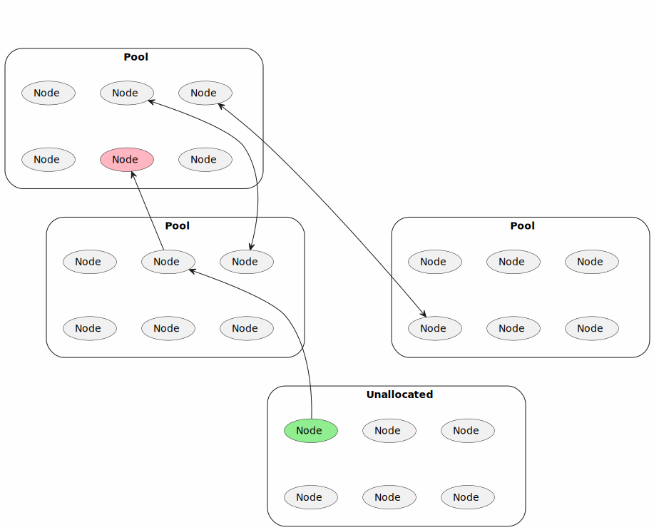

# Blockchain Sharded Storage: Web2 Costs and Web3 Security with Shamir Secret Sharing

## Abstract

CPU scaling for blockchain is solved. However, storage scaling is still a problem. This document describes 
a sharded storage solution for blockchain to store really big amounts of data (beyond petabytes) with Web2 
cost and Web3 security. With this solution, rollups no longer need to store their blocks on-chain. In other 
words, we can upgrade validiums to rollups. The solution is based on [Shamir's Secret Sharing](https://en.wikipedia.org/wiki/Shamir%27s_Secret_Sharing) 
and [Fast Fourier Transform](https://zcash.github.io/halo2/background/polynomials.html#fast-fourier-transform-fft). 
If we have N numbers, we can represent it as a polynomial of degree N-1. We can evaluate this polynomial 
at M points and get M values. Then we can restore the polynomial from any N values. In the note, we will 
show how to use this approach to build horizontal scalable fault-tolerant storage.

## Introduction

### Problem Statement

One of the commonly used existing solutions is replication of data. It stores each data chunk should 
at multiple nodes. Nodes produce zero-knowledge proofs of data availability. When the number of nodes 
storing the chunks is low, the network distributes the chunks to other nodes.

Let's discuss some of the disadvantages of this approach making it more expensive than Web2 storage.

1. Replication of data. If we want to build a 50% fault-tolerant network with 128 bits of security, 
we need to replicate data 128 times. It means that the network should store and transfer 128 times 
more data than the original data size.

2. Zero-knowledge proofs of data availability. The data replicas contain the same information. However, 
we need to implement a unique representation for each replica. Otherwise, multiple nodes can collude and 
store only one replica. Replica-to-replica transformation should be a complex problem to prevent collusion 
and force each node to store its replica. It means that the zero-knowledge proof of data availability 
becomes a complex problem.

3. Data distribution. The nodes go online and offline. If a malicious actor controls a significant part 
of the network, they can try to collect all data replicas for one file one by one, which will lead 
to data loss. The sound way to prevent it is random redistribution of data replicas when some of 
the nodes go offline.

Below we propose our solution to solve these problems.

Also, our solution is native zkSNARK-friendly. That means that we can include proofs of data availability 
in proofs of rollup state transitions. It will allow us 

### Comparison with existing solutions

> :memo: **TODO:** write a table with a comparison of sharding and replication

## Architecture

Let's consider a 4-level model of the sharded storage network:

At the first level, we have the L1 blockchain. The L2 rollup publishes state-to-state transition 
proofs and the root hash of the state.

> [!TIP]
> We do not need to publish the data of blocks. We are describing sharded storage, so, all data will 
be safely stored at the nodes and the zk proof contains the proof of data availability.

At the second level, we have the L2 rollup. It checks proofs of space-time for new nodes, adds it to 
the list of active nodes, removes inactive nodes, and performs mixing of nodes between pools to prevent 
potential attacks. Also, state-to-state transition proofs for L3 rollups are published here.

At the third level, we have the L3 rollup. The sharding means that we need to convert the data into $n$ 
shards when $k\leq n$ shards are enough to restore the data. The L3 rollup is responsible for consistency 
between all nodes. Also, users rent space at the L3 rollup using their payment bridges. L3 rollup 
aggregates proof of the data availability using function interpolation at random points for data blocks.

At the fourth level, we have storage nodes. The nodes are part of the consensus for the corresponding 
pool. Also, the nodes store the data and provide proof of data availability. All space of 
the nodes should be filled with special plots, like in Chia Network, but with some differences, 
making it more suitable for our case and ZK-friendly.

### Plotting

To prevent spam from malicious nodes with not enough space, we should implement an efficient mechanism, 
allowing nodes to prove, that they have enough space to store the data.

In the chapter [Space-Time Tradeoff](#space-time-tradeoff), we will provide a more exact description, 
of how it could be implemented.

## Economic Model

All nodes receive the same reward for storing the data or maintaining the empty space, which is the same complexity due to [complexity leveling](#complexity-leveling-and-protection-against-centralized-supernodes).

The first source of rewards is token emission with a Bitcoin-like formula. Rewards are distributed to the nodes using [proof of space-time mining](#space-time-tradeoff-and-plotting), like in the Chia Network.

The second source of rewards is fees. First, let's consider the simplified model: we have time epochs, and the nodes rent space for these epochs. The rent is paid in tokens.

Let $c$ be the average price for the previous epoch, and $c'$ is the price for the next epoch. 

In the new epoch, the users can buy out the slots with price from $\alpha c$ til $\beta c$.

## Theoretical framework

### Shamir's Secret Sharing

[Shamir's Secret Sharing](https://en.wikipedia.org/wiki/Shamir%27s_Secret_Sharing) is a method for 
distributing a secret among a group of participants, each of which is allocated a share of the secret. 
The secret can be reconstructed only when a sufficient number of shares are combined. The sufficient 
number is called the threshold. The threshold can be any number between 1 and the total number of shares. 
The secret cannot be reconstructed from any number of shares less than the threshold.

One of the simplest ways to implement Shamir's Secret Sharing is to use a polynomial of degree N-1. We can 
represent the N-sized secret as a polynomial of degree N-1. We can evaluate this polynomial at M points and 
get M values. Then we distribute these values among M participants. The secret can be restored from any 
N values.

> [!TIP]
> The way we use Shamir's Secret Sharing here can be alternatively characterized as encoding the data 
with [Reed–Solomon Error Correcting Code](https://en.wikipedia.org/wiki/Reed%E2%80%93Solomon_error_correction) 
and decoding with erasures (not errors). Especially since the message we encode is not secret. In the following, 
we keep calling it Secret Sharing because more readers may be familiar with this term.

For well-selected $N$ and $M$, we can restore the secret if most of the participants will go offline. 
We will use this property to build a fault-tolerant storage of publicly available data.

### Polynomial Computation for Data Recovery

Let's consider $p(x)$ is a polynomial of degree $N-1$ and the secret is the evaluation representation of 
this polynomial over evaluation domain $\mathbf{D}=\{0,\ 1,\ 2,\ ...,\ N-1\}$:

$\mathbf{S} = \{p(0),\ p(1),\ p(2),\ ...,\ p(N-1)\}$

We will compute the polynomial over the extended evaluation domain $0,\ 1,\ 2,\ ...,\ M-1$ and 
distribute the values to M participants.

Let's represent the case when all participants excluding N are going offline. So, we get the following 
values:

$\mathbf{V} = \{p(k_0),\ p(k_1),\ p(k_2),\ ...,\ p(k_{N-1})\}$
over evaluation domain
$\mathbf{K} = \{k_0,\ k_1,\ k_2,\ ...,\ k_{N-1}\}$.

Let's define Lagrange polynomials over evaluation domain $\mathbf{K}$:

$$\mathbf{L_i}(x) = c_i \prod_{j \neq i} \left(x - k_j\right),$$

where $c_i$ is a constant coefficient, so that $\mathbf{L}_i(k_i) = 1$.

Let's define matrix $\mathbf{L}_{ij}=\mathbf{L}_i(j)$.

Then the secret can be restored as follows:

$$\mathbf{S_j} = \sum_{i} \mathbf{V_i} \cdot L_{ij}$$

> [!NOTE]
> What happens, if some of the participants are malicious and send incorrect values? To prevent 
this problem, there are a lot of ways. For our partial case, we will merkelize all values and 
distribute them to all participants with Merkle proofs. Then we can check the correctness of 
each value, checking the root of the Merkle proof. If the root is incorrect, we can ignore 
the value.

### Soundness  Analysis

Let's consider $p$ as part of honest nodes in the network, So, if a total number of nodes is $N$, 
$pN$ are honest, and $(1-p)N$ of them are malicious. If shards are distributed by nodes by random, 
$p$ also is the probability, that the node will be honest. Then if we have $n$ shards with threshold 
$k$, the probability that the secret cannot be restored means that only strictly less than $k$ shards 
are stored by honest nodes. The probability is defined by the following binomial distribution:

$$\mathbf{P}(p,n,k) = \sum_{i=0}^{k-1} \binom{n}{i} p^i (1-p)^{n-i},$$

where 

$$\binom{n}{i} = \frac{n!}{i!(n-i)!}$$

is a binomial coefficient.

For $0.05 < p < 0.95$, $n>30$, $np>5$, $n(1-p)>5$, we can use the normal approximation of 
the binomial distribution ([source](https://online.stat.psu.edu/stat414/lesson/28/28.1)).

$$\mathbf{P}(p,n,k) \approx \frac{1}{2} \left[1 + \mathrm{erf}\left(\frac{k-1/2-np}{\sqrt{2np(1-p)}}\right)\right].$$

The soundness of could be defined as follows:

$$\mathbf{S}(p,n,k) = -\log_2 \mathbf{P}(p,n,k).$$

Then we can calculate the soundness for different values of $p$, $n$, and $k$. For example, 
if $p=1/2$, $n=1024$, $k=256$,

then $\mathbf{S}(1/2,1024,256) = 190$ bits of security.

### Comparison with Replication

For replication, the probability of data loss could be computed with the following formula:

$$\mathbf{P}(p,n) = (1-p)^n,$$

where $p$ is the probability that a node is honest, otherwise it is malicious, and $n$ is 
the number of replicas.

The soundness of replication could be defined as follows:

$$\mathbf{S}(p,n) = -\log_2 \mathbf{P}(p,n).$$

To compare sharding using Shamir's Secret Sharing and replication, we will compare 
the blowup factor for 64 and 128 bits of security in case the 1/4, 1/2, and 3/4 nodes of 
the network are honest. 

From the modeling, we can observe:

1. The blowup factor for replication is much higher than for sharding
2. The blowup factor for sharding is growing slower than for replication when security 
is growing
3. The blowup factor depends on the sharding threshold $k$, the higher the threshold, 
the lower the blowup factor

### Dynamic Nodes Mixing against Malicious Actors

If sharding is static, we need just initially select the nodes for each pool. However the uptime 
of the nodes is not infinite, and if only malicious nodes are left in the pool, the data will be 
lost. To prevent this problem, we need to mix the nodes in the pools periodically. The mixing 
should be done in a way, that the malicious nodes cannot predict the new shard for the data.

Let's consider $n$ as the number of nodes in a pool.

For the best strategy for the malicious actor: keep the malicious nodes in the pool and wait when 
the honest node to go offline, we can describe the evolution of the pool as a Markov process. To 
protect from this strategy, the network performs $m$ mixings. We can find the equilibrium distribution 
for this process and find the probability that less than $k$ nodes in the pool are honest.

For example, if $p=1/2$, $k=64$, $n=512$, $m=3$, then soundness is $115$ bits of security.

### Space-time Tradeoff and Plotting

For proof of space-time mining, we need to build a plot which is an array of high entropy data,
and computing any one element of this array without storing the whole array should be a hard
problem.

The approach how to build plots is described at [AACKPR2017](https://eprint.iacr.org/2017/893.pdf).

To build the plot, let's define 

$f_1(x)=h(x),$

$f_{i+1}(x) = h(x, x_1),$ where

$|f_i(x)+f_i(x_1)| < s_0,$

$ x_1 = 0 \mod s_1 $,

$h$ is a hash function.

At [AACKPR2017](https://eprint.iacr.org/2017/893.pdf) it is shown that the space-time tradeoff formula for $f_n$ takes the form 

$S^n T = O(N^n)$.

If n is big enough, it is optimal for a server to store all data.

To perform spacetime proof, the node receives a random challenge $c$ and should find a $s_0$-close preimage $x_c$ of $f_n$:

$|f_n(x_c)-c| < s_0$, and also provide all computations of $f_n(x_c)$.

Proof complexity is growing as $O(2^n)$, so in practice, it is useful to build proof for $k=7$ or $k=8$ ([Chia proof of space construction](https://www.chia.net/wp-content/uploads/2022/09/Chia_Proof_of_Space_Construction_v1.1.pdf)). That means that if the node stores twice less data then it should compute 128 or 256 times more hashes to provide the proof.

Proofs with bigger $k$ could be used inside zkSNARKs.

### Polynomial Representation of the Data

Let's consider $F_i$ as an N-sized array of data we need to store. We can represent it as table 
$F_{ij}$ with $M$ rows and $K$ columns, $N=M \cdot K$.

Then we can represent the table as bivariate polynomial $F(x,y)$ of degree $M-1$ over $x$ and 
degree $K-1$ over $y$:

It can be noted that $F(x,y_0)$ represents the linear combination of the columns of the table. 
To distribute the data to $K_1$ nodes, we can evaluate the polynomial at $K_1$ $y$ points and 
distribute the values to the nodes.

Commitment to shard could be verified with the following polynomial equation:

$$F(x,x^M)-F(x,y_0) = (x^M-y_0) \cdot Q(x),$$

where $Q(x)$ is a quotient polynomial.

### Complexity Leveling and Protection Against Centralized Supernodes

Let's consider the following two attack vectors:

1. Files have different entropy. Low entropy files are easier to store. But the reward is 
the same. That means that malicious nodes can generate large entropy files and store them 
on small disk drives. To prevent this attack, we need to level the complexity of the data.

2. Also, the nodes can collude and store all the data on one node. If we use k-of-n sharding, 
this one supernode can store only source data, which has the same complexity as storing k 
shards only. This is not safe. To prevent this attack, we need to make the same 
complexity for decentralized and centralized cases, so the nodes will not have any profit 
from centralization.

All these attacks could be prevented with the following approach:

Each node generates a high entropy plot and makes a commitment of function $G$, which is very
close to this plot. This fact could be verified with random openings of the polynomial:

$$G(x_i) = \text{plot}(x_i)$$

If we perform enough random openings, we can be sure that the entropy of $G$ is high enough.

The seed of the plot should be derived from the shard commitment. Then the node can store 
the sum of the shard and plot and provide proof of data availability for this sum to receive
the reward.

$$F'(x) = F(x, y_0) + G(x)$$

So, minimal storage complexity for all nodes and one malicious supernode is the same, and
complexity leveling is achieved: it is enough hard to store the array of zeros and the array
of random values.

If $G$ is not exactly equal to the plot, it does not matter. When the network recovers the data, 
the honest node can restore the initial data by itself or send the deterministic script on how 
to do it.

### Selection of Polynomial Commitment Scheme

We propose using FRI, because it is not additive-homomorphic, and it is more suitable for 
our case. The usage of additive-homomorphic commitment schemes could lead to attacks when 
the malicious nodes use MPC to compute proofs of data availability without storing all data.

To build a random proof of random opening of the polynomial commitment, the prover should
keep all the data. Other nodes cannot help him to compute this proof with the MPC procedure.

## Appendices

