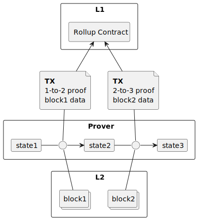
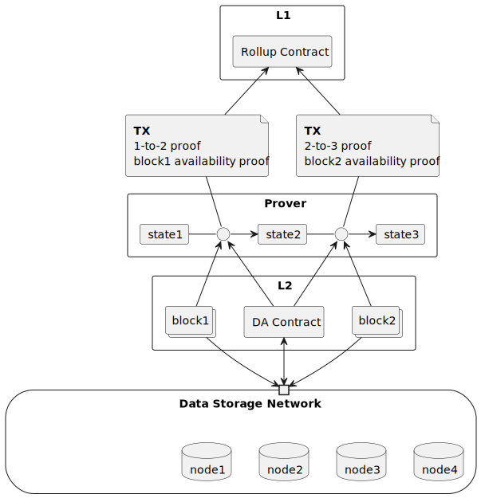

# Minimal fully recursive zkDA rollup with sharded storage

## Current zk rollup state

zkRollups scale execution efficiently, but publish all blocks at L1. This is not scalable for storage and forbids recursive rollups: if we deploy a rollup on a rollup, we need to publish all the blocks of the inner rollup on the outer rollup, and the outer rollup will publish all its blocks on L1.

There were some attempts to solve this problem, like validiums, but they are weak on both decentralization and security (2 of 3 in Vitalik's trilemma).

## Existing improvements in unlocking data availability and decentralized storage

### Chia

Chia introduced a novel consensus algorithm called Proof of Space and Time (PoST), which provides a more decentralized and energy-efficient alternative to Proof of Work (PoW): Proof of Space-Time (PoST). PoST is a consensus algorithm that uses storage space as a resource to secure the network.
The current capacity of Chia Network is 33 EiB. 

### EthStorage

Ethstorage is replication-based DA and storage, managed by a smart contract.

## Our results

In our [research draft](https://ethresear.ch/t/blockchain-sharded-storage-web2-costs-and-web3-security-with-shamir-secret-sharing/18881) we propose a solution for storage and data availability, friendly to zk rollups and unlocking new scalability opportunities.

### Sharding instead of replication

It is proposed to use $k$ of $n$ threshold data representation. So, any $k$ numbers from the source file are transformed into $n$ numbers. And any $k$ of these $n$ numbers can restore the source $k$ numbers. This is called Shamir's Secret Sharing.

This approach allows us to utilize storage 10-20 times more efficiently than the replication-based approach, according to our modeling.

Also, it gives us better protection from physical-level attacks, like target node destruction.

### Unlimited horizontal scalability

We propose to use a 2-level nested rollup structure (below we will describe, why it is possible). The top-level rollup manages participants of low-level rollups and mixes them to prevent the accumulation of malicious participants in one low-level rollup. Low-level rollups manages the data, stored in the nodes.

### Polynomial commitments everywhere

We propose to use Merkle trees on the top level of database. However, the minimal structure is a polynomial commitment to a cluster of data. So, it is very friendly to rollups, because we can use the same polynomial commitment to represent the rollup's block.

Also, out of the box we have data availability oracle (just provide random polynomial lookup on the commitment) and all linear algebra we needed for sharding.

### Data mining

Nodes can use the data for mining, like in Chia. And the result of mining is zero-knowledge proof of data availability. 

The complexity of storage is leveled, so it is the same complexity to store random data or zeros.

Nodes can join to network with trustless zk proof of their capacity.

## Bring it all together

ZK Rollups usually publish on-chain proof of execution and data of the block.
But our data availability and proof of storage are zk. So, we can merge it all together and publish the proof of execution and data availability and storage in one single ZK proof.

It unlocks the deployment of rollups on rollups, and the rollups on rollups on rollups, and so on. And way to transform Web2 into Web3.

Also, we can prevent the bloating of the blockchain: if we publish the snapshot state of the rollup, previous history could be removed.

## Some economics

On 1st Jan 2024 cost of storage, 1GiB was:

* Ethereum $1.8M
* EthStorage $10k
* Celestia $300
* Near $10

Based on [Hetzner sx294](https://www.hetzner.com/dedicated-rootserver/sx294/) with 8 blowup factor (what we need for >100 bits of security), the annual cost of storage 1GB is $0.15 usd.

The cost will be lower on specialized rigs.

## Call for discussion and feedback

We believe our proposed solution has the potential to significantly improve the scalability and efficiency of zk rollups and upgrade Web2 to Web3. However, we acknowledge that this is still a research draft and there may be challenges or considerations we haven't fully addressed.

We welcome discussion, feedback, and constructive criticism from the community. If you have insights, ideas, or see potential issues with our approach, please share them.