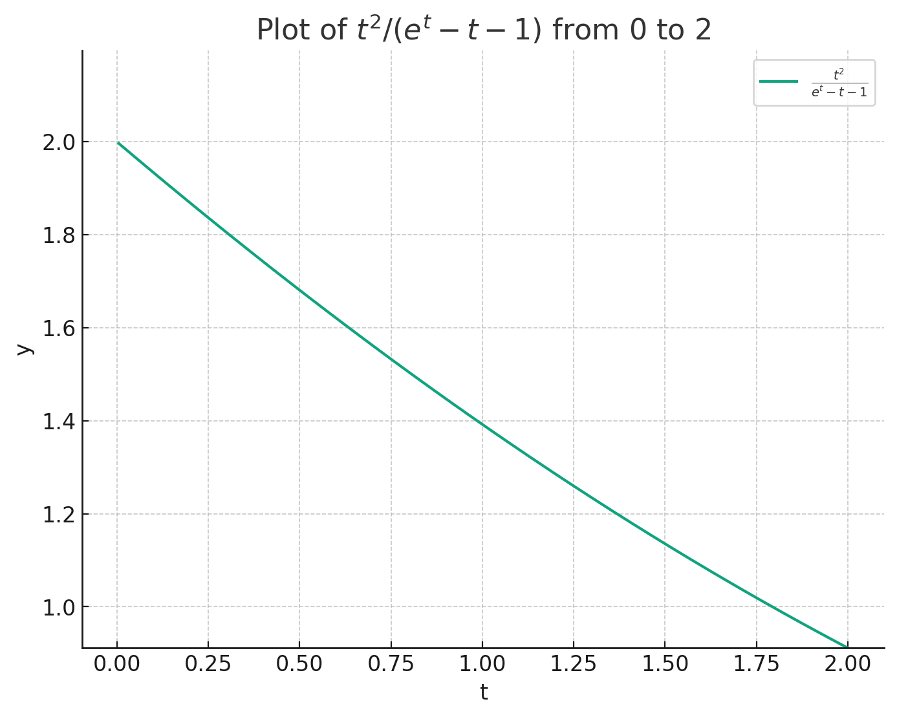
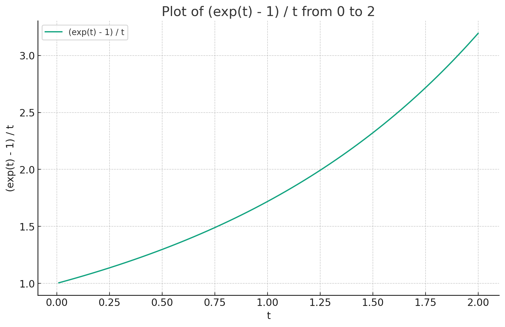

# Mining attacks on EthStorage PoRA

## Security model

The attacker can split the equipment to optimize the mining procedure. For example, if the attacker uses half of the item, then the cost, maintenance cost, and throughput will be half. Also, the attacker can replace the equipment with another one, which is more efficient. We will consider two vectors of attacks: shrink attack (for example, replacing 1TiB NVMe with cheaper 1TB, but with the same throughput) and Moore attack (for example, replacing gen 4 chip with gen 5 chip, when costs are the same, but throughput is 2 times more).

## Shrink attack

### Unlimited mining throughput

We consider that if we reduce the size of memory twice, the maintenance cost (energy consumption) and throughput will be the same and the cost will be reduced twice. In real life, the energy consumption will be lower, but we perform here a pessimistic estimation.

Then, if we shrink the memory module and normalize it by the cost, we will get the following table:

|     | Cost | Maintenance | Throughput |
| --- | ---- | --- | --- |
| reference | 1 | $A$ | 1 |
| attacker | 1 | $\chi A$ | $\chi$ |

where $A \sim 1$ is maintenance cost (energy consumption) and $\chi$ is throughput advantage of the attacker.

The total cost efficiency is better for the attacker, because if we reduce the memory size, $\chi>1$.

$$\frac{1}{1+A} < \frac{\chi}{1+\chi A} = \frac{1}{1/\chi+A}$$

We see that the original PoRA is not resistant to shrink attacks. The only way to protect it is to limit the mining rewards.

### Limited mining throughput

Let's fix the optimal throughput to 1 and calculate the cost efficiency for the attacker.

The attacker is using only the $p$ part of the memory. Let's consider $n$ as the number of random accesses.
Let's consider $q=1-p \ll 1$, $qn \sim 1$.

Then efficient average number of accesses is $n_e = (1-p^n)/(1-p) \approx (1 - \exp(-qn)) / q$ 
and success probability is $p_s = p^n \approx \exp(-qn)$.

The slowdown of mining is $\tau = n_e/(n \cdot p_s) = (\exp(qn)-1)/(qn)$.

|     | Cost | Maintenance | Throughput |
| --- | ---- | --- | --- |
| reference | 1 | $A$ | 1 |
| attacker | 1 | $\chi A$ | $\chi$ |
| attacker | $p$ | $\chi p A$ | $\chi p$ |

To consume all throughput, the following equation should be satisfied:

$\chi p / \tau = 1$

$\chi = (\exp(qn) - 1)/((1-q) qn )$

For efficient mining, the following expression should be satisfied:

$p\cdot (1 + \chi A) < 1 + A$

$\chi < (1/A+1)/p - 1/A = (1/A+1)(1+q) - 1/A = 1 + (1/A+1)q$

Substituting $\chi$:

$(\exp(qn) - 1)/((1-q) qn ) < 1 + (1/A+1)q$

$(\exp(qn) - 1)/(qn) < 1 + q/A$

$(\exp(qn) - 1)/(qn)^2 - 1/(qn) < 1/(An)$

$An < (qn)^2/(\exp(qn) - qn - 1)$

For $0 \leq qn \leq2$ it holds, if at least

$An < 2$

This expression does not hold, because

$A \sim 1$ and $n \gg 1$.

So, the shrink attack is not efficient, if the mining rewards are limited.

By the way, if current equipment does not provide enough throughput, miners can use a shrink strategy to increase the throughput till the limit.

## Moore attack

The fact that miners will align to the throughput limit is important when we consider the Moore attack. 

|     | Cost + Maintenance| Throughput |
| --- | ---- | --- | 
| reference | 1 | 1 |
| attacker | 1 | $\chi$ |
| attacker | $p$ | $\chi p$ |

After the upgrade, the attacker will have more throughput, but the cost will be the same.

$\chi p / \tau = 1$

$\chi = (\exp(qn) - 1)/((1-q) qn )$

$\chi (1-q) = (\exp(qn) - 1)/(qn)$

For Moore attack, $\chi \sim 2$, $q \ll 1$, so we can rewrite the equation as

$\chi = (\exp(qn) - 1)/(qn)$

From the plot, we get $qn \sim 1$.

That means that if the storage size is 1 TB, and the value size is 1 MB, then the number of random accesses should be about 1M to make the Moore attack inefficient. Otherwise, the attacker will have an advantage, if some values are removed from the storage.

## RAM rig

Dot product efficiency for modern CPU is about 2GB/J for the Goldilocks field. 

The performance for NVMe is about 13.7GB/s (Crucial T705 1TB for 188 USD). TDP is 15+6.85=21.85W. Efficiency is 0.6GB/J
The performance for DDR5 is about 72GB/s (8GB DDR5-4800 for 25 USD). TDP is 10+36=46W. Efficiency is 1.6GB/J

If we consider the equipment lifetime is 4 years,
for NVMe we spent 2758134240 J, which costs about 107 USD, so the total cost is 295 USD and get 1729 PB 
for DDR5 we spent 5806598400 J, which costs about 226 USD, so the total cost is 251 USD and get 9088 PB

RAM mining is 6 times more efficient than NVME mining.
The small size of RAM is not an issue: the problem is parallelizable very well, so it could be solved on a cluster of small machines.

For the fixed size of storage, RAM mining is 673 times faster, than NVMe mining.
